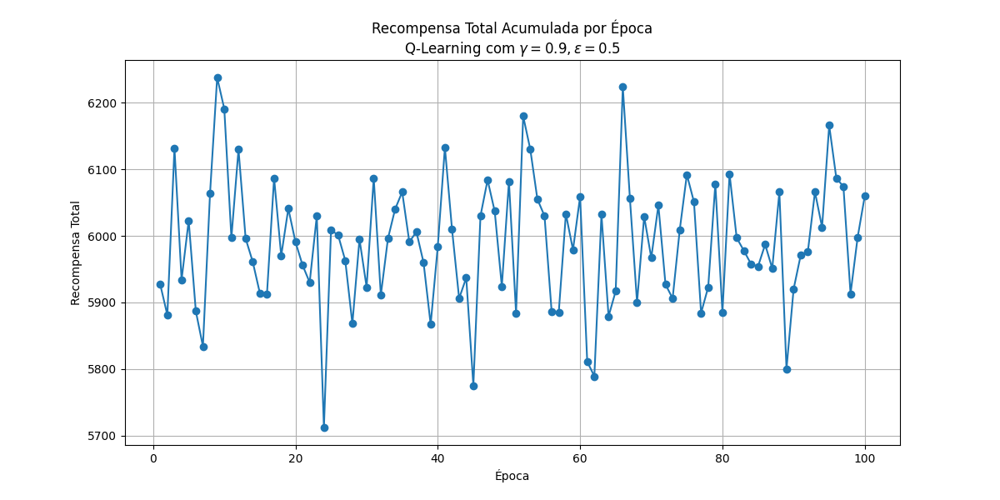

# Robô de Reciclagem - _Reinforcement Learning_ - Projeto 1
## Amanda Perez & Lucas Westfal

Repositório criado para implementar um algoritmo de aprendizado por reforço para um robô de reciclagem, como projeto 1 do curso de [Aprendizado por Reforço](https://github.com/fccoelho/Reinforcement-Learning-course/) da FGV EMAp. O enunciado do trabalho encontra-se disponível no arquivo `enunciado.md`. 

A seguir, neste mesmo documento, apresentamos o relatório do projeto, com a descrição do problema e os resultados observados.

> *Ambos os participantes dessa tarefa trabalharam equivalentemente no desenvolvimento do projeto, majoritariamente por meio de programação em par.*

-----

# *Relatório*

## Introdução

Este trabalho apresenta a implementação e análise de algoritmos de aprendizado por reforço para solucionar o problema do robô de reciclagem, conforme descrito por Sutton & Barto [1]. Foram implementados dois métodos de aprendizado por diferença temporal (TD): TD(0) para avaliação de política e Q-Learning para a busca direta da política ótima. O estudo explora a influência de hiperparâmetros, como a taxa de exploração ($\epsilon$) e o *discount factor* ($\gamma$), no comportamento e na convergência do agente. Os resultados demonstram a importância da exploração (política $\epsilon$-greedy) para a descoberta da política ótima em comparação com uma abordagem puramente greedy, além de evidenciarem como o fator de desconto molda a estratégia do agente entre recompensas imediatas e ganhos a longo prazo, por meio de curvas de aprendizado (recompensa por época) e as políticas ótimas resultantes por meio de mapas de calor.

## Descrição do problema

Consideramos um robô de reciclagem, conforme apresentado no Exemplo 3.3 (página  52) de [1], que deve coletar latas em um ambiente. Seu funcionamento depende de uma bateria, que pode estar alta ou baixa, e o robô pode escolher entre andar em busca de latas, ficar parado esperando que alguém o entregue alguma lata ou ir recarregar. Dessa forma, o espaço de estados $\mathcal{X}$ descreve os níveis da bateria e é dado por:

$$\mathcal{X} = \lbrace \textrm{alta}, \textrm{baixa} \rbrace,$$
enquanto o espaço de ações é:
$$\mathcal{A} = \lbrace \textrm{procurar}, \textrm{esperar}, \textrm{recarregar} \rbrace$$

Quando a bateria está baixa, todas as ações são possíveis. Quando a bateria está alta, não é possível recarregar, apenas buscar ou esperar. O ambiente no qual o agente está inserido é modelado da seguinte forma:
- o estado da bateria só se altera se o robô estiver procurando;
- a cada iteração procurando com bateria alta, a probabilidade de a bateria permanecer alta é de $\alpha$;
- a cada iteração procurando com a bateria baixa, a probabilidade da bateria não acabar é $\beta$;
- quando a bateria acaba, o robô é resgatado, sua bateria recarregada e o *reward* recebido é $r_{\textrm{rescue}} = -3$;
- cada lata encontrada fornece $1$ de *reward*;
- ao procurar, o valor esperado de latas coletadas (e, portanto, do *reward* obtido) é $r_{\textrm{search}}$;
- ao esperar, o valor esperado de latas coletadas (e, portanto, do *reward* obtido) é $r_{\textrm{wait}}$;
- nenhuma recompensa é obtida ao recarregar, ou seja, o *reward* é $r_{\textrm{charge}} = 0$.

Para nossa implementação, consideramos $\alpha = 0.9$, $\beta = 0.7$, $r_{\textrm{search}} = 8$ e $r_{\textrm{wait}} = 2$, mas esses valores podem ser facilmente alterados no código.

Nota-se que este é um processo de decisão de Markov finito e com poucas combinações de espaço-ação, o que possibilita o uso de métodos tabulares. Em especial, conforme solicitado na descrição do trabalho, podemos usar métodos de diferenças temporais (*temporal differences*, ou TD). Existem diferentes métodos de RL baseados em TD, mas optamos por implementar dois: TD(0) e Q-Learning. O primeiro foi escolhido por ser o mesmo aplicado no exemplo do jogo da velha, apresentado em aula, enquanto o segundo foi escolhido por incorporar mais informações sobre o contexto e buscar a política ótima de maneira mais direta.

## Soluções

Usando *temporal difference learning*, o problema pode ser resolvido equivalentemente por diferentes métodos capazes de estimar a política ótima; usamos TD(0) (mais método de atualização de política) e Q-Learning.

### TD(0)

O TD(0) por si só apenas é um algoritmo de avaliação. Ele nos dá o valor de estar em um estado $s$ sob uma política específica $\pi$, $V(s)$.

Atualizamos TD(0) por:

$$ V(s) \leftarrow V(s) + \eta \left[ R + \gamma V(s') - V(s) \right], $$

onde $\eta$ denota o *learning rate*. Em geral, referências como [1] e [2] utilizam $\alpha$ para representar o *learning rate*, entretanto, para evitar confusão com a probabilidade $\alpha$ de a bateria continuar alta, optamos por utilizar aqui $\eta$.

Como a atualização depende do valor do próximo estado, $V(s')$, que foi obtido por seguir a política $\pi$, o método não procura politica ótima mas sim avalia a qualidade da política atual - se fazendo necessário método adicional para evoluir as políticas. 

O código para aprender *tic-tac-toe*, apresentado em aula e adaptado para resolver esse problema, adota essa metodologia.

### Q-Learning

Em contraste, o *Q-learning* aprende diretamente o valor de tomar ação $a$ em um estado $s$, $Q(s, a)$. Por exemplo, com ele podemos encontrar política ótima $\pi^*$ durante um jogo, dado o conhecimento acumulado do jogo.

A atualização da função $Q$ é feita pela seguinte equação:

$$ Q(s, a) \leftarrow Q(s, a) + \eta \left[ R + \gamma \max_{a'} Q(s', a') - Q(s, a) \right], $$

com $\eta$ sendo o *learning rate*.

Onde com $\max_{a'} Q(s', a')$ encontramos ação $a'$ que maximiza a função $Q$ depois de tomada ação $a$. É atualizado o valor da ação atual $(s, a)$ assumindo que a melhor ação possível será tomada no próximo estado $(s')$, independentemente da ação que a política de exploração realmente escolheu. Isso o torna um método *off-policy*, pois aprende sobre a política ótima (*greedy*) enquanto segue outra política (por exemplo, $\epsilon$-*greedy*).

## Implementação

O código implementado encontra-se disponível no arquivo `main.ipynb`. Acompanhando o código, estão alguns comentários para complementar e melhorar a legibilidade. 

Fora criada uma classe para simular o ambiente e duas classes para simular o agente, uma destinada ao TD(0) e outra ao Q-Learning.

Buscando seguir uma estrutura parecida com a do exemplo do jogo da velha, foram definidas as classes (com apenas as descrições abaixo):

- `Enviroment`: responsável por fornecer a lista de ações possíveis para cada estado e realizar as transições de estado seguindo o modelo descrito na [descrição do problema](#descrição-do-problema).

```
class Environment:
    """
    Simula o ambiente do robô de reciclagem.
    Gerencia as transições de estado e as recompensas com base nas ações do robô.
    """
    def get_available_actions(self, state):
        """ Retorna as ações possíveis para um dado estado. """
        ...

    def step(self, state, action):
        """
        Executa uma ação e retorna o próximo estado e a recompensa.
        A lógica de transição é baseada nas probabilidades alfa e beta.
        """
        ...

```

- `AgentTD`: implementa um agente que segue o método TD(0). Conta com um passo a mais com relação ao Q-Learning, que atualiza a policy após avaliar a nova função de $V(s)$.

```
class AgentTD:
    """
    Agente que usa TD(0) para avaliação e melhora a política de forma explícita.
    """
    def __init__(self, discount_factor, epsilon, learning_rate=LEARNING_RATE):
        ...
    def choose_action(self, state):
        """
        Escolhe uma ação baseada na política atual (com exploração epsilon-greedy).
        """
        ...

    def update(self, state, reward, next_state):
        """
        PASSO DE AVALIAÇÃO: Atualiza o valor do estado V(s) usando a regra do TD(0).
        V(s) <- V(s) + lr * [R + gamma * V(s') - V(s)]
        """
        ...

    def improve_policy(self):
        """
        PASSO DE MELHORA: Atualiza a política para ser greedy em relação aos valores de estado atuais.
        Para cada estado, escolhe a ação que maximiza a recompensa esperada.
        """
        ...

    def save_policy(self, filename="policy_td0.pkl"):
        ...

```


- `AgentQ`: implementa um agente que segue o método Q-Learning. O código é parecido com o do caso TD(0), mas sem o passo de atualizar separadamente a política.

```
class AgentQ:
    """
    O agente que aprende a política ótima usando Q-learning (um método TD).
    """
    def __init__(self, discount_factor, epsilon, learning_rate=LEARNING_RATE):
        ...

    def get_q_value(self, state, action):
        """ Acessa o valor Q para um par (estado, ação), retornando 0 se não existir. """
        ...

    def choose_action(self, state):
        """
        Escolhe uma ação usando uma política epsilon-greedy.
        - Com probabilidade (1 - epsilon), escolhe a melhor ação (explotação).
        - Com probabilidade epsilon, escolhe uma ação aleatória (exploração).
        """
        ...

    def update(self, state, action, reward, next_state):
        """
        Atualiza o valor Q para o par (estado, ação) usando a regra do Q-learning.
        Q(s, a) <- Q(s, a) + lr * [R + gamma * max_a'(Q(s', a')) - Q(s, a)]
        """
        ...

    def save_policy(self, filename="policy.pkl"):
        """ Salva o dicionário de valores Q em um arquivo. """
        ...

    def load_policy(self, filename="policy.pkl"):
        """ Carrega o dicionário de valores Q de um arquivo. """
        ...
```


Em sendo um "jogo infinito", foram simuladas 1000 iterações por 100 épocas, para gerar os *rewards* e *heatmaps* como solicitado.

Funções auxiliares (para gerar imagens e treinar os modelos) também podem ser encontradas em `main.ipynb`. 

Além das classes e funções, foram definidas algumas variáveis globais, que foram mantidas fixas ao longo dos experimentos. Mais especificamente, essas variáveis descrevem $\alpha$, $\beta$, $r_{\textrm{search}}$, $r_{\textrm{wait}}$, $r_{\textrm{rescue}}$ e $r_{\textrm{charge}}$, além de parâmetros de implementação, como o *learning rate* e os números de épocas e de iterações. 

## Resultados e discussão

Para explorar a influência dos hiperparâmetros no aprendizado de cada método, fixamos valores das recompensas e rodamos os jogos com diferentes valores de $\varepsilon$ e $\gamma$. Também comparamos o efeito de tomar ou não políticas exploratórias durante o treinamento.


### Explorando $\epsilon$

- TD(0)

Primeiramente, utilizando o método TD(0), fixamos $\gamma = 0.9$ e tomamos $\varepsilon \in \lbrace 0.0, \ 0.1, \ 0.5 \rbrace$.

Em todos os cenários, a política ótima aprendida ao fim do treinamento opta por procurar sempre que a bateria está alta e recarregar sempre que a bateria está baixa, não havendo grande diferença entre os *heatmaps*. Entretanto, a evolução dos *rewards* ao longo das épocas apresenta diferenças. 

<p float="left">
  
  
</p>

<p float="left">
  
  
</p>

<p float="left">
  
  
</p>

Nas imagens acima, é possível notar que há maior oscilação quanto maior o valor de $\varepsilon$. Isso faz sentido, pois significa uma maior probabilidade de exploração, i.e., escolher políticas aleatoriamente. No primeiro cenário, com $\varepsilon = 0.0$, temos a adoção de um aprendizado *greedy*, e o *reward* se mostra muito mais estável.

Ao adotar uma abordagem *greedy*, espera-se que o modelo rapidamente convirja para uma otimalidade local, frequentemente subótima. Isso não é observado aqui, provavelmente porque o problema é simples. A maior influência dos valores de $\epsilon$ é em diminuir o reward médio, uma vez que a policy estava saindo constantemente da otimal.

<!-- 

 -->

<!-- 


 -->


- Q-Learning

Utilizando o método Q-learning, fixamos $\gamma = 0.9$ e tomamos $\varepsilon \in \lbrace 0.0, \ 0.1, \ 0.5 \rbrace$.


<p float="left">
  
  
</p>

<p float="left">
  
  
</p>

<p float="left">
  
  
</p>

Aqui o fenômeno de convergência subótima ocorre, com a policy greedy não explorando a ação de recarregar a bateria.

Já com $\epsilon$ grande (0.5) o benefício marginal da exploração já se esvaiu, garantindo ao modelo função Q estável mas fazendo escolhas subótimas com grande frequência.


<!-- 





 -->


<!-- 

 -->

<!-- 


 -->

### Explorando $\gamma$

- TD(0)

Utilizando o método TD(0), fixamos $\epsilon = 0.1$ e tomamos $\gamma \in \lbrace 0.5, \ 0.8, \ 0.99 \rbrace$.


<p float="left">
  
  
</p>

<p float="left">
  
  
</p>

<p float="left">
  
  
</p>


<!-- 


 -->

Os rewards ficaram todos idênticos, evidenciando que a escolha de ações ao longo do aprendizado não é fortemente influenciada por $\gamma$. Isso deve se dar ao fato de o problema ser muito simples; de fato, o dual do grafo cujos vértices são os estados e as arestas são as ações - presente no livro - tem diâmetro 2, portanto é de se esperar que um parâmetro que regule o quanto ações de longo prazo influenciam a escolha de políticas tenha essa característica.


- Q-Learning

Utilizando o método Q-learning, fixamos $\epsilon = 0.1$ e tomamos $\gamma \in \lbrace 0.5, \ 0.8, \ 0.99 \rbrace$.

<p float="left">
  
  
</p>

<p float="left">
  
  
</p>

<p float="left">
  
  
</p>

<!-- 


 -->

<!-- ### Comparando greedy e $\epsilon$-greedy


-->
<!--
- Q-Learning


-->

Nota-se que $\gamma$ pequeno traz prioridade para recompensas imediatas. Aumentando $\gamma$, percebemos mais preferência por recarregar, claramente uma estratégia a "longo prazo". Existe diluição geral do incentivo para procurar com $\gamma$ pequeno, como fica evidente com o heatmap.

Quanto ao reward, para $\gamma$ próximo de 1, percebemos um *reward* médio maior, evidenciando que, nesse jogo, dar peso grande a ações a serem tomadas a longo prazo é benéfico para o reward.

## Conclusão

A implementação dos algoritmos TD(0) e Q-Learning permitiu analisar como os hiperparâmetros $\epsilon$ e $\gamma$ afetam o aprendizado do robô de reciclagem. Constatou-se que a exploração é essencial para evitar políticas subótimas e que valores maiores de $\gamma$ favorecem estratégias de longo prazo, resultando em maior recompensa média.

---
## Referências

[1] SUTTON, Richard S.; BARTO, Andrew G. **Reinforcement Learning: An introduction.** 2. ed. Cambridge, MA, USA: The MIT Press, 2018.

[2] CSABA SZEPESVARI. **Algorithms for Reinforcement Learning.** [s.l.] Morgan & Claypool Publishers, 2010.

‌
